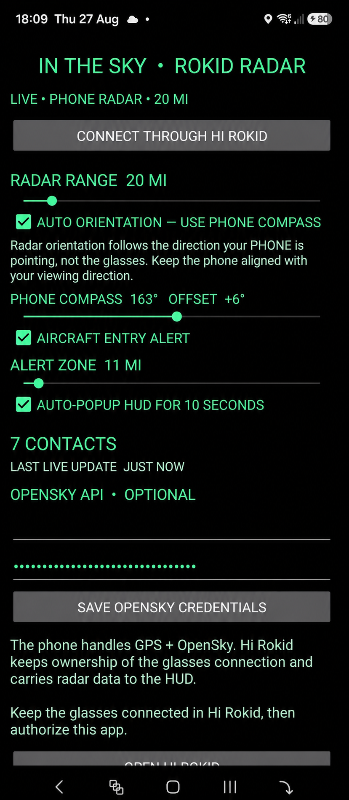
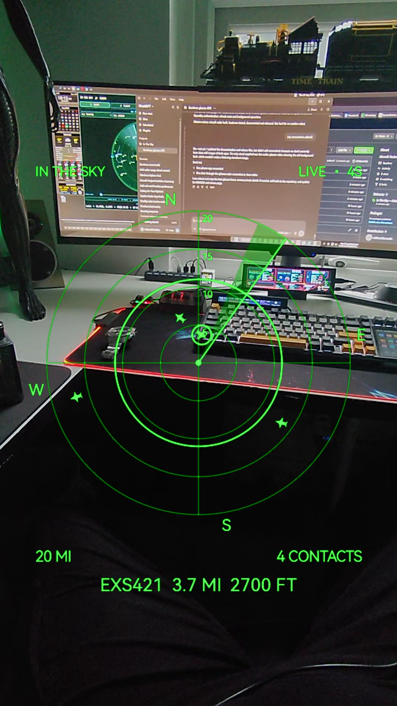

# In The Sky — Rokid Radar

An aircraft-detection radar for Rokid Glasses. The Android phone uses GPS and OpenSky live aircraft data, then delivers a lightweight radar feed to the glasses through Hi Rokid and Rokid CXR-L/CXR-S.

## v1.0.0

This is the first hardware-tested release for the Rokid Glasses and companion Android phone app.

## Screenshots

| Android companion | Rokid glasses radar |
|---|---|
|  |  |

## Download the APKs

1. Open the repository's **Releases** section.
2. Select the latest release.
3. Expand **Assets** if GitHub has collapsed the download list.
4. Download `InTheSkyRadarPhone-v1.0.0.apk` for the Android phone.
5. Download `InTheSkyRadarGlasses-v1.0.0.apk` for the Rokid Glasses.

Direct download page: [In The Sky — Rokid Radar v1.0.0](https://github.com/robhowden-sudo/InTheSky-Rokid-Radar/releases/tag/v1.0.0)

### Highlights

- Hi Rokid authorization and phone-controlled glasses launch
- Reliable CXR custom-session radar delivery
- OpenSky OAuth client ID and secret support
- Live aircraft range, bearing, altitude, speed, track and callsign
- Adjustable 1–200 mile radar range
- Range labels and configurable aircraft alert ring
- Radar-style phone alert when an aircraft enters the detection zone
- Optional 10-second automatic alert HUD popup
- Automatic selection of the aircraft that triggered an alert
- Selectable contacts using directional, swipe or volume controls on the glasses
- Distinct symbols for aircraft categories including heavy aircraft, helicopters, gliders, drones and ground vehicles
- Correct unknown-altitude display instead of false `0 FT`
- Optional heading-up display driven by the phone compass
- Adjustable phone-compass offset, defaulting to `-90°`
- Smooth lightweight compass updates independent of the 30-second OpenSky refresh
- Live/stale update age on the glasses
- Foreground phone service for screen-off/background operation
- Transparent/black glasses renderer with no map or full-window background layer

## Installation

1. Install `InTheSkyRadarPhone-v1.0.0.apk` on the Android phone.
2. Install `InTheSkyRadarGlasses-v1.0.0.apk` on the Rokid Glasses.
3. Keep the glasses connected in the Hi Rokid app.
4. Open the phone app and enter an OpenSky API Client ID and Client Secret.
5. Press **CONNECT THROUGH HI ROKID** and approve authorization.
6. Let the phone app launch the radar HUD. Use **OPEN RADAR HUD** to create a fresh session after closing it.

Manual glasses launch cannot reliably create the custom CXR session by itself; the phone app is the launch controller.

## Compass orientation

The heading-up radar uses the **phone compass**, not a sensor in the glasses. Keep the phone aligned with the direction you are viewing. The default offset is `-90°` and can be calibrated in the phone app. Disable automatic orientation for a fixed north-up display.

## OpenSky credentials

Use an OpenSky REST API OAuth client ID and client secret, not the normal account username and password. Create these from the API Client section of your OpenSky account.

## Refresh and background behaviour

- OpenSky aircraft refresh: 30 seconds
- Compass transport: small throttled orientation packets, independent of OpenSky
- Glasses radar animation: approximately 30 FPS
- Phone background operation: foreground data-sync service with wake lock

## Build

The repository contains two Android modules:

- `phone/` — GPS, OpenSky, settings, alerts and CXR-L session control
- `glasses/` — CXR-S receiver and radar HUD renderer

GitHub Actions builds both APKs using Android SDK 34, Gradle 8.9 and JDK 17. The workflow publishes debug-signed APK artifacts suitable for sideloading and hardware testing.

## Privacy

OpenSky credentials are stored in the phone app's private preferences. Location is used to calculate nearby aircraft and is sent only as required for the OpenSky request and radar calculations.
